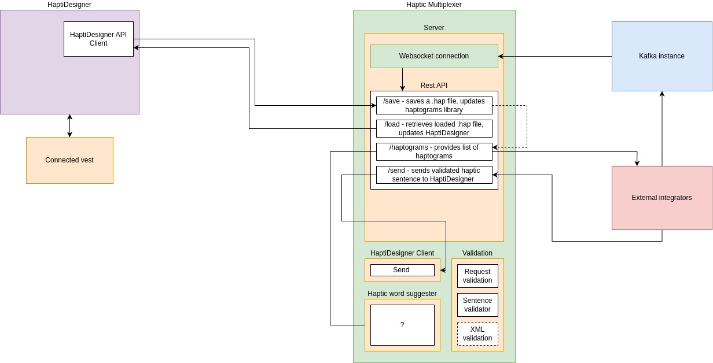

# Haptic Multiplexer

The Haptic Multiplexer is a tool which allows one to create, save, and send haptic patterns to various haptic devices. This is done by building a Docker container, which exposes an API which talks to a database, which holds haptic patterns.

## Code & artifacts

Code lives at on [Github](https://github.com/MuseIT-project/haptic-multiplexer) on a private repository. This is presently accessible by members of the Muse-IT project. Furthermore, Docker images are presently hosted under thomasve/haptic-multiplexer on Dockerhub, subject to agreement where they must live eventually.

There are two software artefacts to speak of:

- The code itself, which is maintained through commits.
- The Docker images, which are versioned releases of the code which form usable artefacts.

## Architecture

The architecture of the Haptic Multiplexer assumes three componets working in interaction:

- The Multiplexer; this is a FastAPI backend which connects the database with the services. The Multiplexer has a REST API to allow for direct integration, has a Kafka listener to ensure data comes in via the REST API, and a Websocket server which acts as host to the connected haptic devices. This is self-documenting via Swagger when the container is started.
- The database; this is simply a Postgres database to which the Multiplexer can connect.
- HaptiDesigner; this is a frontend which talks to the Haptic Multiplexer, and expose it's API through a webinterface. The webinterface is intended to mimic the HaptiDesigner Desktop version both in function and theme.

### Usage & responsibilities

Responsibilities are split as follows:

- The Multiplexer is responsible for:
    - Storing/querying data correctly
    - Offering a REST API to integrators
    - Talking to the connected haptic devices to send haptic sentences
    - Managing users and sessions
    - Receiving input from the API, or other connected tools
- The database is responsible for:
    - Ensuring data integrity
    - Handling queries from the Multiplexer
- The Haptic Designer is responsible for:
    - Providing a user interface for those wishing to graphically use Haptic Multiplexer
    - Hosting QoL features which fall outside the scope of the Multiplexer

### Schematic representation

## Deployment & development

### Environments

Currently, HaptiVerse is hosted at [https://multiplexer.haptics.catdad.nl](https://multiplexer.haptics.catdad.nl). The Swagger interface, which hosts the documentation, lives at [https://multiplexer.haptics.catdad.nl/docs](https://multiplexer.haptics.catdad.nl). This is presently the only live environment, pending the arrangement of a production instance.

### Local development

To locally use HaptiDesigner, do the following:

1. Clone the repo
2. Run `docker compose up --build`
3. Navigate to `http://localhost:8000/docs/`
4. Create a user by making a post to the /users endpoint, and login.
5. Upload a .hap file to load haptograms

### Production deployment

To host an instance of HaptiDesigner, do the following:

1. Build a version with the included Dockerfile
2. Move this to a production server.
3. (Optional, recommended) Include a DNS address to simplify addressing for your users.
4. (Optional, highly recommended!) Include a reverse proxy for SSL termination.
5. Visit your instance either directly by IP or by hostname.
