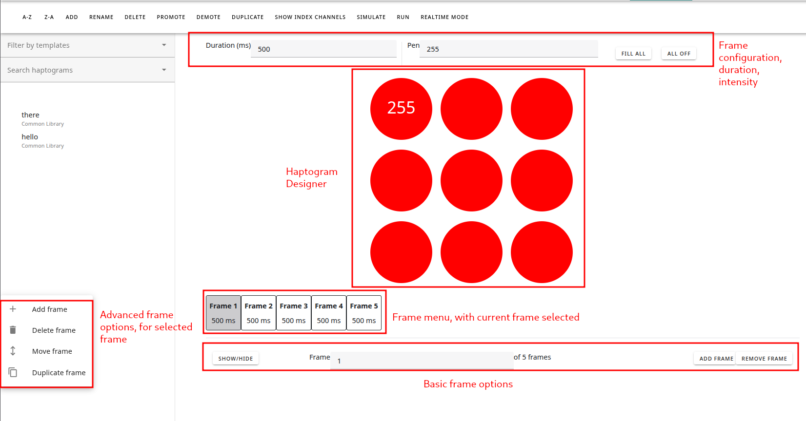
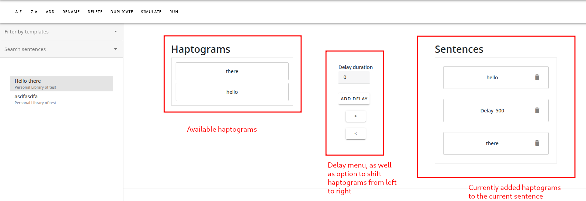

# Introduction to HaptiVerse

This document aims to provide information for usage of the HaptiVerse software. The target audiences are:

- People who are interesting in haptics, and who wish to develop patterns for social haptic communication.
- Developers for haptic hardware, who wish to investigate intercompatibility with haptic patterns and need flexible software to iterate quickly.
- Researchers who work in social haptic communication who wish to create patterns, and test them on a device of their choosing.

## First steps
The first step is accessing the webinterface. Traditionally, this is hosted on an address like `https://haptidesigner.<yourwebhost>.<tld>`. In case you are trying to log in to something not hosted by MuseIT, or are self-hosting, contact the person who is hosting on your behalf to get credentials.

In case you are the person self-hosting, read on below.

### Getting credentials
The initial person who is in charge of your HaptiVerse instance, has likely got credentials with a set of different rights. These are referred to as `admin` level credentials. 

- When he/she logs in, he/she has a button on the top right of his HaptiDesigner instance, called "User management". 
- This is where he/she can create new users, set their permissions, and set/reset passwords.

If you are the person in charge of the HaptiVerse instance and are doing a fresh install (using Docker), you will need to create these credentials automatically. This is relatively straightforward:

- Go to your HaptiMux container; traditionally, this runs on port 8000, unless you've reconfigured this.
- HaptiMux has automatically generated documentation, courtesy of swagger. You may visit this on `http://localhost:8000/api/docs/`, which will provide you a set of URLs.
- As you can see when you arrive there, HaptiMux and HaptiDesigner communicate using encrypted traffic, using OAuth2 with a bearer token.
- When you initially arrive, the instance will be empty. Create a first user using the `/users` endpoint, entering your username and password in plaintext.
- If this is the first user in your instance, you will automatically be admin user.
- Next - try to login with the button for Login on top of the API documentation. If this is successful - congrations, you have a valid user for HaptiDesigner as well.

### Logging in

When you visit the page for HaptiDesigner, the very first thing you will see is the HaptiDesigner login screen.

- Click the top right, and enter the password/username you were provided with by the person managing your HaptiVerse instance.

You should now be logged in, and should see the initial screen for HaptiDesigner.

## HaptiDesigner

Observe the following screen:

The following things are provided:

1. Navigation elements, located on the top right.
2. Tab actions, located in the lower bar. We'll address those in a moment.
3. The template selection (and various other selection interfaces); this is how you select your current work.
4. The main designer component; this will show what you're presently working on.

### The main supported actions & terminology

HaptiDesigner allows one to design various aspects of haptic communication. We refer to these as follows:

- Templates are a haptic canvas - a Carthesian grid of actuators, which are addressable by integers. This is, in short, your virtual haptic device, and the patterns you are about to draw, will need to address this device.
- Haptograms are the patterns you will design upon your canvas - these are the haptic impulses or directives you will send to the person wearing your vest. Haptograms have some further nuances to explore, which we'll do later in this documents.
- Finally, sentences are compound structures of haptograms, allowing you to design meaning-bearing compound structures and send them to your users, in order to verify they are playing fast or slow enough to understand them.

As admin user, you have one extra button:

- User managenent allows you to create, deactivate, activate, promote, or demote users. You can also set their passwords here.

For each of these tabs, various actions are supported.

1. *Add*; creates a new instance of the tab you're presently on (a new template for Templates, a new empty haptogram for Haptograms, etc)
2. *Rename*; renames the currently selected object
3. *Delete*; this deletes the current object. A number of nuances here; if you are a user, you can only remove your own objects, insofar they are not in use by any other dependent structure (ie, you cannot delete a template if you have haptograms that depend on it).
4. *A-Z / Z-A*; allows you to sort in alphabetical or reverse alphabetical order.
5. *Duplicate*; duplices your currently selected object, renaming it in the process to identify it as a duplicate.

As an admin, you have further actions available:

1. *Promote*; Promotes the selected object to the common library. Items in the common library are available to all users.
2. *Demote*; Demotes the selected object to your own user library. This is only possible for items that have not been used by any users; ie, it's an "undo" for promote.

### Templates

Templates are the haptic equivalent of device interfaces. We adhere to the following terminology here:

| Term                | Meaning                                                                                                                                                                |
|---------------------|------------------------------------------------------------------------------------------------------------------------------------------------------------------------|
| Template            | The complete structure of template nodes, representing  a haptic device                                                                                             |
| Template node       | A single node within a template, representing a  single actuator in a haptic device                                                                                 |
| Enabled/disabled    | Whether or not a template node is activated for  usage; this can be useful when avoiding defective  actuators or to create non-Carthesian templates (as spacing) |
| Index               | The positive-integer address of a single actuator - this is  we will refer to this actuator to, when we stream data to your interface.                           |
| Shape               | A shape to visually identify your template node. Shapes can  be used to differentiate between different locations for actuators.                                 |
| Forecolor/backcolor | Coloring schemes allowing you to visually identify/distinguish between different actuator placements or types.                                                      |

#### Template specific actions

A number of specific actions exist for templates:

- Index setting/resetting: Your device might not follow sequential addressing (due to wiring, defective actuators, etc) at all times. Changing the index will allow you to support such configurations. Consequently; removing indexes is an en-masse effect that removes any overrides from the index.
- Shape/color changes; in order to visually distinguish your template nodes, you can change the shape and colors for them to create your own conventions (such as; triangles for shoulders, squares for lower back).
- Disabling/enabling; a template may be disabled or enabled, to avoid it from taking part in haptogram design. This can be useful if your actuators aren't spaced out as a Carthesian grid, creating empty space between actuators visually.

You can also *multiselect* template nodes, to enable or disable in bulk. To enable this, *hold shift or CTRL*, then click the template nodes.

#### Designing templates & making your template recognizable

When designing a template, the following things should be considered:

1. How many actuators are you going to be addressing? This will ultimately determine the minimum amount of actuators you'll need to have enabled at any point in time.
2. How are your actuators spaced out? Are you working with a strict grid, or are you working with empty spaces? If so - create a larger template.
3. Where are your actuators located? Conceptually, how many zones are you going to be addrssing? This will determine what kind of shapes/colors you'll need.
4. Finally, name your template appropriately - often, the name of the device you plan to be addressing, and perhaps an identifying characteristic, are good hallmarks for design.

### Haptograms

The Haptograms screen has a number of components; some of these become visible as you create a new Haptogram:

#### Creating your first haptic pattern

In order to experiment with a first haptic pattern, do the following:

1. Create a new Haptogram using the "Add" button. Name it whatever you like. Use the 3x3 standard configuration (or one of your self-made ones)
2. Watch as it appears
3. Left-click in the Haptogram Designer, and hold this mouse button
4. Draw over the template nodes in a pattern of your choosing.
5. Release your mouse button, and watch the frames appear.

To summarize what we've just done:

1. You created a new haptogram of your choosing.
2. You created your first frames, containing activations.
3. You saved these within the haptogram.

Let's talk about what all those things mean.

#### Frames, nodes, and previewing

When we talk about haptograms, it's important to understand a number of concepts. These are listed below.

| Term       | Meaning                                                                                                                                                      |
|------------|--------------------------------------------------------------------------------------------------------------------------------------------------------------|
| Haptogram  | A meaning-bearing structure represented by sequential, and parallel haptic vibration                                                                      |
| Frame      | A set duration in which haptic vibrations occur, measured in milliseconds (ms).                                                                           |
| Intensity  | An intensity for all activations in a frame.                                                                                                                 |
| Activation | The state of an template node during a frame;  a template node may either activate, or not.  Activated template nodes represent vibrating actuators |
| Sequential | Haptic vibrations that follow one after the  other. This is handled through multiple frames,  each containing activations.                             |
| Parallel   | Haptic vibrations firing at the same time. This is handled through activations in the same frame.                                                         |
| Simulate   | A virtual simulation of all frames and activations.                                                                                                          |
| Run        | Streaming the haptogram to a connected device.                                                                                                               |

#### Advanced usage - parallel activations in the same frame

What you've done during your first haptogram, was create a number of frames, equal to the amount of activations you've drawn over. You may have noticed a few caveats:

- It's impossible to chain multiple actuations on the same node in this manner. If you want this, for some reason: manually add a frame.
- All frames are created with the default duration and intensity you set in the top configuration.

If you want to create activations in the same frame, however, *hold CTRL or shift* as you draw. This will ensure all activations will be set in your currently selected frame.

#### The frame bar - on how to move frames around

On the bottom of the screen, you'll see a number of buttons, allowing you to add and delete frames. These act in the following manner:

1. Adding a frame inserts it after your current frame. It will contain no activations to start with.
2. Deleting a frame deletes your current frame.

But what if you want to move frames, or delete ranges of frames, or undo things in larger actions?

Select any frames, and you'll see a menu + submenu's appear. This menu allows you to do the following:

1. Move frames, either one position to the left or right, or all the way to the beginning or back.
2. Delete frames, either the current one, all except the currently selected one, all before this frame, or all after.
3. Add a frame, either one position to the left or right, or all the way to the beginning or back.
4. Duplicate your current frame, which will be inserted to the right of your current frame. You can then move it around as you need.

#### Simulating and running haptograms

Once you have designed a haptogram, you can do two things with it:

1. You can simulate it, using the *Simulate* button on top. This gives you an on-screen representation of the haptic pattern you're sending, which is walked through frame by frame.
2. If you want to test it on a connected device, you should run it. Selecting the run button gives you an overview of the currently connected devices, which you can then select one or several of. Pressing *send* will send the current haptogram, such as it is, to this device, which will then be tasked with interpretation and playing it.

For the section on how to configure and install your own device, we refer you to the streaming haptograms section of this guide. In case you are considering connecting a new device, please note that is considered something for a software developer to deal with.

### Sentences

Haptograms combine naturally into sentences; similar to natural language, these have pauses, combine several patterns to construct compound meanings. 

You have the following options here:

1. Create a new sentence; you'll need to select a template. This selection will determine what haptograms (related to the same template) are valid for your sentence.
2. Drag parts of the available haptograms from the left to the right, either by dragging and dropping, or by using the `>` and `<` buttons to do so.
3. Add delays between haptic parts. These are like empty frames, containing no activations.
4. Simulate and run, which work similar to what they do in Haptograms.

## Streaming haptograms